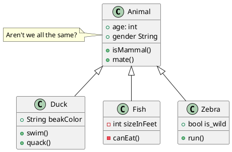
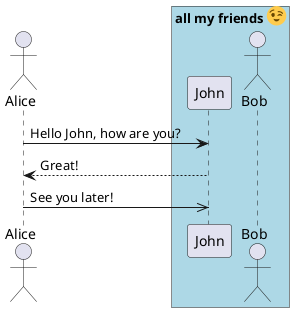
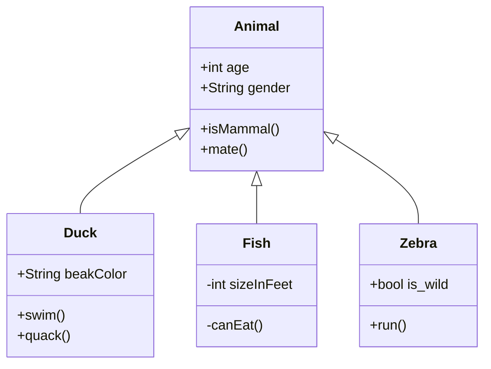
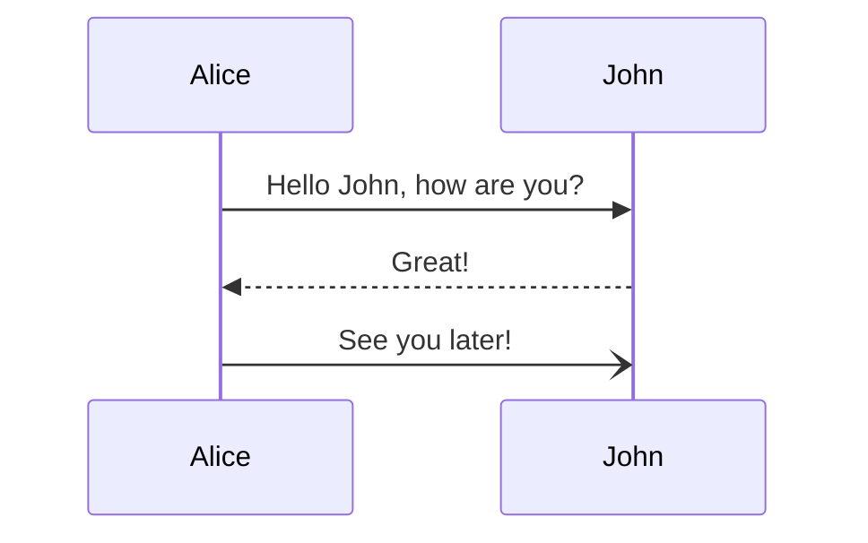

# Demo markdown with some diagrams

## PlantUML

### Class diagram

## Sequence diagram

## [Mermaid](https://mermaid-js.github.io/mermaid/#/)

Mermaid does not (yet) support all the PlantUML type of diagrams. [But they are working on it...](https://github.com/mermaid-js/mermaid/issues/177)

### Class diagram

### Sequence diagram

